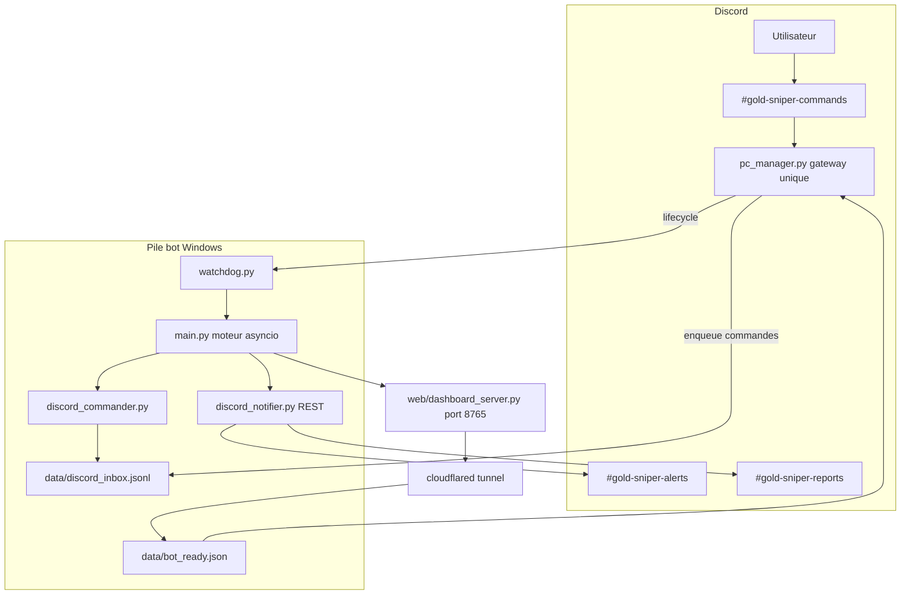

# Gold Sniper V3.1 — Rapport de migration Telegram → Discord

> Document de référence post-mortem pour le conseiller technique.  
> Dernière mise à jour : 2026-05-29  
> **Aucun secret** (tokens, mots de passe) n’est reproduit dans ce fichier.

---

## 1. Résumé exécutif

La version **3.1** remplace l’interface utilisateur **Telegram** par **Discord** pour :

- les **notifications** automatiques (trades, alertes, boot, rapports) ;
- les **commandes opérationnelles** (`!status`, `!agents`, `!pause`, etc.) ;
- le **pilotage du PC** (`!start`, `!kill`, `!restart`, `!pc_status`).

Décisions structurantes :

| Avant (V3.0) | Après (V3.1) |
|--------------|--------------|
| `telegram_notifier.py` + `telegram_commander.py` dans `main.py` | `discord_notifier.py` (REST/embeds) + `discord_commander.py` (inbox) |
| Un bot Telegram écoutait et notifiait | **Un seul gateway Discord** : `pc_manager.py` |
| Commandes `/status` | Commandes `!status` (préfixe `!` ou `/`) |
| Pas de séparation lifecycle / trading | Lifecycle géré par le PC Manager ; trading via file `discord_inbox.jsonl` |

Validation utilisateur (29/05/2026) : `!kill` → `!start` → URL Cloudflare en ~1 min ; embed « Gold Sniper opérationnel » dans `#gold-sniper-alerts` ; `!restart` avec nouvelle URL ; **aucun message dupliqué**.

---

## 2. Architecture cible



### 2.1 Rôles des processus

| Processus | Fichier | Rôle |
|-----------|---------|------|
| **PC Manager** | `pc_manager.py` | Seul client **Discord Gateway** ; reçoit les messages ; lifecycle ; enqueue vers inbox ; attend `bot_ready.json` après `!start` |
| **Watchdog** | `watchdog.py` | Surveille `main.py` ; redémarre après crash (max 3 / 10 min) ; alertes REST Discord |
| **Moteur** | `main.py` | Cold start MT5, dashboard, tunnel Cloudflare, engine, consommation inbox |
| **Commander** | `utils/discord_commander.py` | Lit `discord_inbox.jsonl`, exécute commandes opérationnelles, répond via notifier |
| **Notifier** | `utils/discord_notifier.py` | Embeds vers canaux alerts/reports (API REST, pas de second gateway) |

### 2.2 Règle d’or

**Jamais deux processus connectés au Gateway Discord en même temps.**  
Sinon : doublons de réponses, conflits de session, comportement imprévisible.

---

## 3. Décisions de conception

### 3.1 PC Manager comme unique gateway

`pc_manager.py` expose la classe `PCManagerBot(discord.Client)` avec :

- **Intents** : `message_content`, `guilds`, `members` (MESSAGE CONTENT obligatoire côté portail développeur Discord).
- **Autorisation** : `DISCORD_USER_ID` + canal `DISCORD_COMMANDS_CHANNEL_ID` uniquement.
- **Lifecycle** (`!start`, `!kill`, `!restart`, `!pc_status`) : traitement synchrone dans le manager (MT5, watchdog, cloudflared cleanup).
- **Opérationnel** (`!status`, etc.) : si le moteur tourne → écriture dans `data/discord_inbox.jsonl` + réaction ✅ ; sinon message « moteur arrêté ».

### 3.2 File d’attente inbox (découplage)

Le PC Manager **n’exécute pas** la logique métier des agents. Il enregistre :

```json
{"cmd": "!status", "user_id": "...", "ts": "..."}
```

`discord_command_loop()` dans `main.py` consomme cette file avec verrou cross-process (`utils/inbox_lock.py`) et déduplication (`data/discord_inbox_processed.json`).

### 3.3 Notifications REST

`DiscordNotifier` envoie des **embeds** via l’API REST (`https://discord.com/api/v10`). Le moteur n’ouvre pas de connexion Gateway — seul le PC Manager le fait.

### 3.4 Signal de boot Cloudflare

`utils/bot_ready.py` écrit `data/bot_ready.json` dès qu’une URL `trycloudflare.com` est détectée (`web/dashboard_server.py` → `start_cloudflare_tunnel`).  
Le PC Manager poll ce fichier dans `_wait_for_bot_ready()` (timeout configurable, défaut 180 s) avant de répondre « ✅ démarré — URL ».

### 3.5 Préfixe commandes

`utils/discord_commands.py` normalise `!status`, `/status`, alias FR (`!statut`, `!aide`, `!demarrer`, etc.).

---

## 4. Fichiers créés, modifiés ou supprimés

### 4.1 Nouveaux fichiers

| Fichier | Description |
|---------|-------------|
| `utils/discord_notifier.py` | Remplace `telegram_notifier.py` — embeds, boot, trades, news |
| `utils/discord_commander.py` | Remplace `telegram_commander.py` — consommation inbox |
| `utils/discord_commands.py` | Normalisation commandes + texte d’aide |
| `utils/discord_boot_notify.py` | Notifications boot PC Manager (REST) |
| `utils/bot_ready.py` | Signal `data/bot_ready.json` pour le PC Manager |
| `utils/cloudflared_manager.py` | Cleanup cloudflared / port dashboard |
| `utils/single_instance.py` | Anti-doublons manager / pile bot |
| `utils/lifecycle_lock.py` | Déduplication messages lifecycle Discord |
| `utils/inbox_lock.py` | Verrou fichier inbox |
| `utils/ssl_bundle.py` | SSL Windows / Python 3.14 (truststore) |
| `utils/mt5_bootstrap.py` | Démarrage MT5 avant `!start` |
| `scripts/stop_all_gold_sniper.ps1` | Arrêt complet dépannage |
| `scripts/setup_windows_autostart.ps1` | Une seule tâche planifiée PC Manager |
| `requirements.txt` | Dépendances figées (discord.py, truststore, psutil, …) |

### 4.2 Fichiers modifiés (extrait)

| Fichier | Changement principal |
|---------|---------------------|
| `pc_manager.py` | Bot Discord, lifecycle, attente Cloudflare |
| `main.py` | `discord_command_loop`, SSL, kill_flag |
| `config.py` | Variables `DISCORD_*`, `PYTHON_BIN` |
| `watchdog.py` | `notify_discord` (alias `notify_telegram`) |
| `web/dashboard_server.py` | Tunnel + `write_bot_ready` |
| `core/engine.py` | `discord_sender_loop` |
| `agents/risk_manager.py`, `agent_6_sentinelle.py` | Notifications Discord |
| `utils/report_scheduler.py` | Rapports vers canal reports |

### 4.3 Supprimés / backup

| Fichier | Statut |
|---------|--------|
| `utils/telegram_notifier.py` | Supprimé du dépôt |
| `utils/telegram_commander.py` | Supprimé |
| `utils/telegram_command_listener.py` | Supprimé |
| `utils/telegram_commander.py.bak` | Backup local (non versionné) |

Variables Telegram dans `config.py` : conservées commentées ou en fallback pour rollback documenté.

---

## 5. Configuration Discord (sans secrets)

### 5.1 Portail développeur Discord

1. Application bot → **Privileged Gateway Intents** :
   - MESSAGE CONTENT INTENT (obligatoire)
   - SERVER MEMBERS INTENT (recommandé)
2. Inviter le bot sur le serveur (permissions adaptées).
3. Créer les canaux et copier leurs IDs (clic droit → Copier l’identifiant du salon).

### 5.2 Canaux recommandés

| Canal | Usage |
|-------|--------|
| `#gold-sniper-alerts` | Notifications automatiques, boot, trades |
| `#gold-sniper-commands` | Commandes utilisateur (`!start`, `!status`, …) |
| `#gold-sniper-reports` | Rapports journaliers / hebdo |
| `#gold-sniper-logs` | Logs détaillés (optionnel) |

### 5.3 Variables `.env` (exemple — valeurs à remplir localement)

```env
DISCORD_TOKEN=<token_bot>
DISCORD_GUILD_ID=<id_serveur>
DISCORD_USER_ID=<id_utilisateur_autorise>
DISCORD_ALERTS_CHANNEL_ID=<id_canal_alerts>
DISCORD_COMMANDS_CHANNEL_ID=<id_canal_commands>
DISCORD_REPORTS_CHANNEL_ID=<id_canal_reports>
DISCORD_LOGS_CHANNEL_ID=<id_canal_logs>

# Optionnel — interpréteur Windows
PYTHON_BIN=C:\Users\<user>\AppData\Local\Python\pythoncore-3.14-64\pythonw.exe
```

### 5.4 Dépendances Python

```powershell
python -m pip install -r requirements.txt
```

Paquets critiques ajoutés pour la migration : `discord.py`, `truststore`, `certifi`, `psutil`, `matplotlib`.

---

## 6. Difficultés rencontrées et correctifs

### 6.1 Tableau synthétique

| # | Problème | Symptôme | Cause racine | Correctif |
|---|----------|----------|--------------|-----------|
| 1 | **Auto-suicide Cloudflare** | `!start` → timeout 180 s ; `main` crash code=1 ~5 s | `cleanup_before_tunnel()` appelait `stop_cloudflared_processes(include_listeners=True)` et **tuait le PID** écoutant sur le port 8765 — c’est-à-dire `main.py` lui-même | `include_listeners=False` par défaut dans `utils/cloudflared_manager.py` ; `True` uniquement dans `prepare_clean_stack_start()` avant un nouveau lancement |
| 2 | **Watchdog en boucle** | 3 restarts puis arrêt | Conséquence du #1 — `bot_ready.json` jamais écrit | Même correctif #1 |
| 3 | **Réponses Discord en double** | 2× `!start`, 2× embeds | Plusieurs `pc_manager.py` (tâche planifiée + raccourci Démarrage) | Lock `data/pc_manager.lock`, `terminate_duplicate_managers`, autostart **unique** (`setup_windows_autostart.ps1`), `scripts/stop_all_gold_sniper.ps1` |
| 4 | **`!kill` incomplet** | Bot relancé après kill | `kill_flag` + watchdog ignorant l’arrêt | `kill_flag.txt`, poll dans `main.py`, respect dans `watchdog.py`, cleanup cloudflared |
| 5 | **PC Manager muet** | Aucune réponse Discord | Échec SSL Python 3.14 (`CERTIFICATE_VERIFY_FAILED`) | `utils/ssl_bundle.py` + `truststore` + hook `_async_setup_hook` sur `PCManagerBot` |
| 6 | **Mauvais Python** | Comportements incohérents | `shutil.which("pythonw")` → Python Windows Store | `PYTHON_BIN` dans `config.py` ; `_resolve_pythonw()` évite `WindowsApps` |
| 7 | **`!health` / `!chart`** | ImportError | `psutil`, `matplotlib` absents | Ajout dans `requirements.txt` + script `install_deps.ps1` |
| 8 | **Port 8765 occupé** | WinError 10048 | Instances multiples de `main` | `prepare_clean_stack_start()`, anti-doublons pile |
| 9 | **SSL watchdog Discord** | Alertes crash non envoyées | Même cause SSL 3.14 sur `urllib` | Notifications watchdog via REST ; SSL corrigé côté manager |

### 6.2 Détail du bug critique #1 (Cloudflare)

**Chronologie observée :**

1. `main.py` démarre `bootstrap_dashboard()` → bind `0.0.0.0:8765`.
2. En parallèle, `start_cloudflare_tunnel()` appelle `cleanup_before_tunnel()`.
3. L’ancienne logique listait les PIDs en écoute sur 8765 et exécutait `taskkill /F` — **y compris le processus courant**.
4. Le moteur mourait avant d’écrire `bot_ready.json` ; le PC Manager attendait 180 s puis affichait « timeout Cloudflare ».

**Correctif validé par test local :** cold start complet + URL Cloudflare en ~7 s + `bot_ready.json` présent.

---

## 7. Procédure de validation

Tests réalisés dans `#gold-sniper-commands` :

| Test | Commande / action | Résultat attendu |
|------|-------------------|------------------|
| 1 | `!kill` | Un seul message « arrêté » |
| 2 | `!start` (après kill) | Message « démarrage en cours » puis **une** réponse avec URL `trycloudflare.com` |
| 3 | Embed alerts | « Gold Sniper opérationnel » avec lien dashboard |
| 4 | `!restart` | Nouvelle URL Cloudflare |
| 5 | `!status`, `!help` | Réponse unique (moteur actif) |
| 6 | Anti-doublon | Aucun message en double sur la séquence ci-dessus |

Dépannage si anomalie :

```powershell
powershell -ExecutionPolicy Bypass -File scripts\stop_all_gold_sniper.ps1
# Puis relancer un seul PC Manager : LancerManager.bat
```

---

## 8. Mapping commandes Telegram → Discord

| Telegram (V3.0) | Discord (V3.1) | Géré par |
|-----------------|------------------|----------|
| `/start` (bot) | `!start` | PC Manager |
| `/kill` | `!kill` | PC Manager |
| `/restart` | `!restart` | PC Manager |
| `/status` | `!status` ou `!statut` | Inbox → commander |
| `/pause`, `/resume` | `!pause`, `!resume` | Inbox |
| `/risk 0.5` | `!risk 0.5` | Inbox |
| `/agents`, `/regime`, `/news` | `!agents`, `!regime`, `!news` | Inbox |
| `/report`, `/backtest`, `/calibrate` | `!report`, `!backtest`, `!calibrate` | Inbox |
| `/help` | `!help` ou `!aide` | PC Manager (offline) ou inbox (online) |
| — | `!pc_status` | PC Manager (état RAM/CPU même si bot arrêté) |
| — | `!health`, `!chart`, `!logs`, `!memory` | Inbox (extensions V3.1) |

---

## 9. Rollback Telegram (urgence)

1. Restaurer `utils/telegram_commander.py.bak` → `utils/telegram_commander.py`.
2. Réactiver les imports Telegram dans `main.py` / `engine.py`.
3. Désactiver le lancement Discord du PC Manager.
4. Renseigner `TELEGRAM_TOKEN` et `TELEGRAM_CHAT_ID` dans `.env`.

Non testé en production après migration — prévoir une fenêtre de maintenance.

---

## 10. Annexe — Checklist implémentation (sans secrets)

Résumé des étapes suivies lors du développement :

1. Créer application Discord + intents + canaux.
2. Ajouter variables `DISCORD_*` dans `config.py` et `.env`.
3. Implémenter `discord_notifier.py` (parité fonctionnelle Telegram).
4. Implémenter `discord_commander.py` + inbox JSONL.
5. Refondre `pc_manager.py` en gateway unique + lifecycle.
6. Brancher `bot_ready.json` / Cloudflare / MT5 bootstrap.
7. Anti-doublons (`single_instance`, `lifecycle_lock`, autostart unique).
8. Corriger SSL Python 3.14 et `PYTHON_BIN`.
9. Corriger `cleanup_before_tunnel` (ne pas tuer le dashboard actif).
10. Valider bout en bout sur Discord.

---

## 11. Règles absolues (maintenance)

- Ne jamais exposer `DISCORD_TOKEN` dans les logs ou commits Git.
- Ne jamais publier `localhost:8765` sur Discord — toujours l’URL Cloudflare publique.
- Un seul PC Manager actif par machine.
- `!kill` avant un `!start` forcé si la pile semble bloquée.
- Vérifier `logs/pc_manager.log` et `logs/watchdog.log` en cas de timeout boot.

---

*Fin du rapport — Gold Sniper V3.1*
